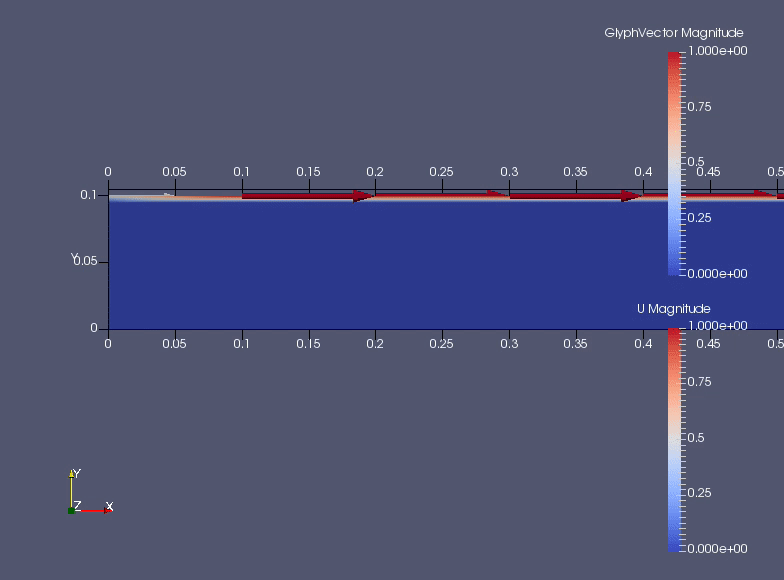

# OpenFOAM data visualisation with matlplotlib
 
Convert OpenFOAM data to VTK format with foamToVTK* and make images and movies of 2D and 3D plots of scalar and vector data using python and matplotlib.

This method requires no user interaction and can be used in automated workflows.

\* foamToVTK is included in OpenFOAM distribution.

## Sample data
Flow between two plane-parallel plates. Top plate is moving with a horizontal velocity V relative to the other and there is 
no pressure gradient.
https://www.scribd.com/document/273227125/OpenFOAM-Tutorial

### Static images compared to Paraview

##### Pressure distribution in Paraview

##### And in matplotlib: side panel surfaces in 3D and in XY plane (Z=0)

##### Velocity visualisation in Paraview

##### And in matplotlib

### Dynamic velocity visualisation compared to Paraview

##### Velocity visualisation in Paraview

##### And in matplotlib: side panel (Z=0)

## Execution environment 

Run Jupyter notebook in Docker container.

Build Docker image with included Dockerfile.
Sample data is in VTK folder. Mount this folder into container /openfoam directory. Use `./startcontainer.sh` command.

## Requirements

See Dockerfile for required packages and installation steps on Debian. On Ubuntu installation is very similar, but some package names are different.

# Jupyter notebooks

See notebooks for sample data visualisation code.

## Notebooks

in VTK folder

Notebook | Description
--- | ---
[Read_VTK.ipynb](ppWall/VTK/Read_VTK.ipynb) | Tests reading VTK data and plotting it.
[plot\_scalar\_in\_3D\_and\_2D.ipynb](ppWall/VTK/plot_scalar_in_3D_and_2D.ipynb) | Compare plotting in 3D and 2D plane projection of scalar data.
[velocity\_plot\_2D.ipynb](ppWall/VTK/velocity\_plot\_2D.ipynb) | Plot velocity vector field in 2D projection.
[save2flie.ipynb](ppWall/VTK/save2flie.ipynb) | Save velocity dynamics into series of png files with 2D projections.

